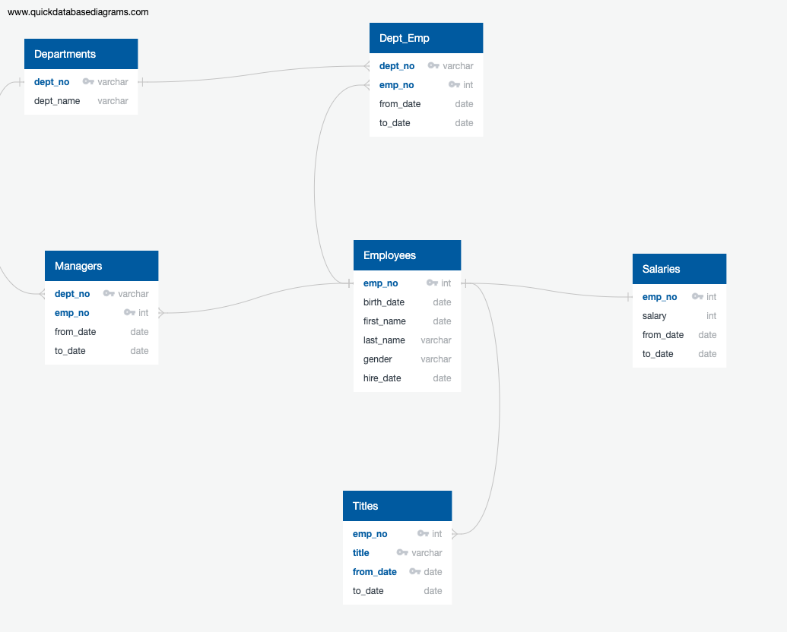

# Overview

The Pewlett Hackard organization wishes to perform an anaysis of the impending **silver tsunami**. In a nutshell, the **silver tsunami** describes the phenomenon where the organization is faced with a lot of older near-retirement employees, whose departure could leave a big void. The organization wants to analyze the data and find out the answers to two questions:
* How many employees are nearing retirement.
* How many employees are ready to take over.

# Data Description

## Input Data

We are presented with six different datasets in form of cvs files:
* [employees](Data/employees.csv)
* [departments](Data/departments.csv)
* [department of each employee](Data/dept_emp.csv)
* [managers of each department](Data/dept_manager.csv)
* [salaries of employees](Data/salaries.csv)
* [titles of employees](Data/titles.csv)

## Data Model for RDBMS

In essence, there are two *independent* entities:
* Employees
* Departments

The first two tables describe various attributes of these independent entities. The third table ties them together by establishing a relationship (which employee belongs to which department). The fourth table describes which employees are department heads - in this case, the relationship can be viewed as *reversed* (i.e. which department is headed by which employee). The last two tables describe salaries and titles of an employee. The reason they are broken out of the employee table is because typically a **one to many** relationship exists (i.e. the same employee can have multiple titles indicating inter-department moves or career progression). Having said this, we note the **salaries table has a one to one relationship with the employees table**. This is not typical. In this case, having a separate salaries table has no functional value.

The process of breaking data into different tables and establishing a relationship between them is called **data normalization**, and it is considered to be the *rai·son d'ê·tre* of RDBMS (relational database management systems).

The data model can be described by the following **Entity Relationship Diagram** (abbreviated as ERD). As seen there, the departments and employee tables provide **dept_no** and **emp_no** as the primary keys. They also act as *source of truths* for the other tables, which reference those numbers by establishing a foreign relationship with the aforementioned two tables.

## Primary and Foreign Keys for Each Table

A primary key for a table uniquely identifies a row. There can never be two rows with the same primary key. A foreign key establishes a link between a value of a table to another table's value. This provides **referential integrity** in the whole system (for example, deleting or updating an employee's ID in the *employees* table would guarantee the same operation is performed in all tables linking back to the *employees* table, leaving the system in a *consistent state*).

The following table describes primary keys of all tables.

|  Table | Primary Key | Comments	| 
| ------ | ----------- | -------- | 
| **employees** | emp_no | Each employee is uniquely identified by its employee number |
| **departments** | dept_no | Each department is uniquely identified by its department number |
| **dept_emp** | (dept_no, emp_no) | Both department and employee guarantee uniqueness of a row since an employee could move to multiple departments during their tenure |
| **dept_manager** | (dept_no, emp_no) | Both department and employee guarantee uniqueness of a row. A) A department can have multiple managers through the course of time. B) The same employee could manage different departments (although such instance doesn't appear in this dataset, the model allows it) |
| **salaries** | emp_no | As noted earlier, this table seems to record only one salary instance of an employee; hence only employee number suffices to guarantee uniqueness |
| **titles** | (emp_no, title, from_date) | To understand why we need a tuple with three values to ensure uniqueness here: A) An employee can have multiple titles. B) An employee can have the exact same title on different dates (which can happen if they move between departments) |

# Analysis and Results

After importing the CSV files into tables in a postgres database (by establishing the proper relationships and 
